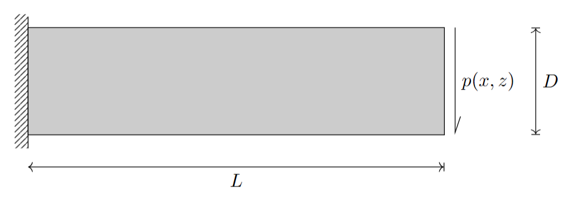
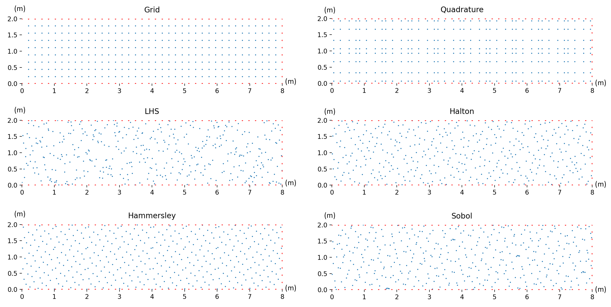
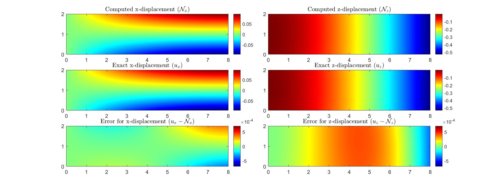

The code requires the following packages as imports:
-	tensorflow
-	tensorflow_probability
-	numpy
-	time
-	scipy
-	geomdl


Run the following line:
```bash
python Cantilever.py
```

## Cantilever Beam Example

To demonstrate the implementation of DNB using the vector approach discussed in Section [PINNs], we consider a simple example of a cantilever beam. This beam, shown in the figure below, has dimensions: depth $D$, length $L$, and unit thickness. The beam has prescribed displacements at $x = 0$ and sustains an end load $p(z)$.

### Problem Description

The equilibrium equation is:

$$
-\nabla \cdot \sigma(x,z) = f(x,z) \quad \text{for } x, z \in \Omega
$$

with the strain-displacement equation:

$$
\varepsilon(x,z) = \frac{1}{2}(\nabla u + \nabla u^T)
$$

and the constitutive law:

$$
\sigma = \text{Constitutive Law Expression}
$$

Here:
- $\sigma$: stress tensor
- $\varepsilon$: strain tensor
- $f$: body force
- $u = (u_x, u_z)$: displacement field
- $\Omega$: problem domain

Boundary conditions:
- **Dirichlet boundary**: $u(x,z)=\hat{u}(x,z) \quad \text{for } x, z \in \Gamma_D$
- **Neumann boundary**: $\sigma \cdot n = \hat{t}(x,z) \quad \text{for } x, z \in \Gamma_N$

### Beam Geometry and Load


*Figure: Cantilever beam with length $L$ and depth $D$.*

### Analytical Solution

For a rectangular domain with corners $(0, 0)$ and $(8, 2)$ m, Dirichlet boundary conditions at $x=0$ are:

$$
u_x(z) = \frac{Pz}{6EI_{yy}} \left((2+\nu)(z^2-\frac{D^2}{4})\right)
$$

$$
u_z(z) = -\frac{\nu}{2}\frac{PL z^2}{EI_{yy}}
$$

Parabolic traction at $x=L$:

$$
\hat{t}(z) = P \left( \frac{z^2 - D z}{2I_{yy}} \right)
$$

Where:
- $P = 2 \, \text{MN}$: maximum traction
- $E = 10^5 \, \text{MPa}$: Young's modulus
- $\nu = 0.25$: Poisson's ratio
- $I_{yy} = \frac{D^3}{12}$: second moment of area of the cross-section

### Results Validation

Stress distribution for the cantilever (from Timoshenko and Goodier):

$$
\sigma_{xx} = \frac{P (L-x) z}{I_{yy}}, \quad \sigma_{zz} = 0, \quad \tau_{xz} = - \frac{P}{2I_{yy}} \left( \frac{D^2}{4} - z^2 \right)
$$

Displacement field:

$$
u_x = -\frac{Pz}{6EI_{yy}} \left( (6L - 3x)x + (2+\nu)\left(z^2 - \frac{D^2}{4}\right) \right)
$$

$$
u_z = -\frac{P}{6EI_{yy}} \left( 3\nu z^2(L-x) + (4+5\nu)\frac{D^2x}{4} + (3L-x)x^2 \right)
$$

### Sampling Strategies

To enforce physical constraints, we investigated six sampling methods:

1. **Equispaced Uniform Grid (Grid)**
2. **Gaussian Quadrature Points (Quadrature)**
3. **Latin Hypercube Sampling (LHS)**
4. **Halton Sequence (Halton)**
5. **Hammersley Sequence (Hammersley)**
6. **Sobol Sequence (Sobol)**



*Figure: Examples of 400 points generated in $[0, 2] \times [0, 8]$ using different sampling methods.*

### Performance Comparison

| Method       | Train Error (\%) | Test Error (\%) |
|--------------|------------------|-----------------|
| Grid         | 0.472            | 0.465 ± 0.210   |
| Quadrature   | 0.220            | 0.218 ± 0.052   |
| LHS          | 0.049            | 0.048 ± 0.016   |
| Halton       | 0.011            | 0.012 ± 0.007   |
| Hammersley   | 0.024            | 0.024 ± 0.010   |
| Sobol        | 0.174            | 0.178 ± 0.104   |

### Optimization and Convergence

The network, trained using the Adam optimizer and the BFGS method, achieved convergence as shown below:


### Computed Results

The final computed solution for the cantilever beam is:



### References

1. S. Timoshenko. Theory of elasticity. Oxford, 1951.
2. P. Ramachandran, B. Zoph, and Q. V. Le. “Searching for activation functions”. In: arXiv preprint
arXiv:1710.05941 (2017). doi:  https://doi.org/10.48550/arXiv.1710.05941.
3. C. Wu et al. “A comprehensive study of non-adaptive and residual-based adaptive sampling for physics-
informed neural networks”. In: Computer Methods in Applied Mechanics and Engineering 403 (2023),
p. 115671. doi: https://doi.org/10.1016/j.cma.2022.115671.
4. M. D. McKay, R. J. Beckman, and W. J. Conover. “A comparison of three methods for selecting
values of input variables in the analysis of output from a computer code”. In: Technometrics 42.1
(2000), pp. 55–61. doi: https://doi.org/10.2307/1268522.
5. J. H. Halton. “On the efficiency of certain quasi-random sequences of points in evaluating multi-
dimensional integrals”. In: Numerische Mathematik 2 (1960), pp. 84–90. doi: https://doi.org/10.1007/BF01386213.
6. J. Hammersley and D. Handscomb. “Monte Carlo methods”. In: Ltd., London 40 (1964), p. 32. doi:
https://doi.org/10.1007/978-94-009-5819-7.
7. I. M. Sobol’. “On the distribution of points in a cube and the approximate evaluation of integrals”.
In: Zhurnal Vychislitel’noi Matematiki i Matematicheskoi Fiziki 7.4 (1967), pp. 784–802. doi: https://doi.org/10.1016/0041-5553(67)90144-9.