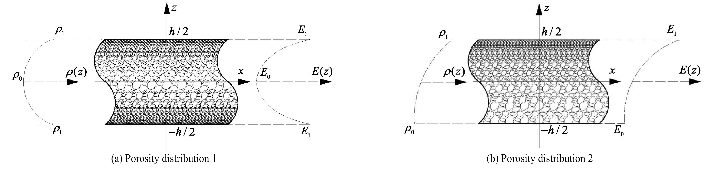

This directory contains solvers which are compatible with Jax. 

The code requires the following packages as imports:
-	jax
-	numpy
-	functools
-	tqdm
-	geomdl
-	collections
-	os
-	time
-	matplotlib

For getting the result for one example run the following line:
```bash
python Porous_DEM_BC_H-H.py
```
For creating database, run the following line:
```
python Porous.py
```
After creating database or downloading and extracting it, for drawing figures from the database, run the following code in MATLAB
```bash
main.m
```

## Functionally Graded Porous Beam

This example presents the bending analysis of functionally graded porous beams to implement the energy approach in DNB, as discussed in the [energy method section](#). The example assumes that the elasticity moduli and mass density of porous composites vary along the thickness based on two distinct distribution patterns. The mechanical properties of an open-cell metal foam are examined as a representative case to establish the correlation between density, porosity coefficients, and the porous beams' bending behavior, described by a system of PDEs. The example explores three different boundary conditions: hinged-hinged (H-H), clamped-clamped (C-C), and clamped-hinged (C-H) end supports.

### Porosity Distribution Patterns



**Porosity Distribution 1 (Symmetric):**

$$
E(z) = E_1 \left[ 1 - e_0 \cos(\pi \zeta) \right], \quad
G(z) = G_1 \left[ 1 - e_0 \cos(\pi \zeta) \right], \quad
\rho(z) = \rho_1 \left[ 1 - e_m \cos(\pi \zeta) \right]
$$

**Porosity Distribution 2 (Asymmetric):**

$$
E(z) = E_1 \left[ 1 - e_0 \cos\left(\frac{\pi}{2} \zeta + \frac{\pi}{4}\right) \right], \quad
G(z) = G_1 \left[ 1 - e_0 \cos\left(\frac{\pi}{2} \zeta + \frac{\pi}{4}\right) \right], \quad
\rho(z) = \rho_1 \left[ 1 - e_m \cos\left(\frac{\pi}{2} \zeta + \frac{\pi}{4}\right) \right]
$$

An FG porous beam of thickness $ h $ and length $ L $, with two different porosity distributions along the thickness, is depicted in the figure above:
- **(a):** Porosity Distribution 1 (symmetric) based on Magnucki's study.
- **(b):** Porosity Distribution 2 (asymmetric) based on Jabbari's study.

### Validation of Results


The dimensionless bending deflection under a uniformly distributed load $(L/h = 20)$ is validated against Chen et al.'s results. The material parameters for the steel foam used in this study are:
- $E_1 = 200 \, \text{GPa}$,
- $\nu = 1/3$,
- $\rho_1 = 7850 \, \text{kg/m}^3$.

The porosity coefficient $ e_0 = 1 - E_0 / E_1 $ (where $ 0 < e_0 < 1 $) defines the variation in elasticity moduli, and $ e_m = 1 - \rho_0 / \rho_1 $ defines the variation in mass density.

### Stress and Strain Distributions

#### Stress Distribution for Asymmetric Porosity


#### Strain Distribution for Symmetric Porosity


### Displacement Field

#### Displacement Distribution for Asymmetric Porosity


### Implementation Details

To calculate the displacement field, a neural network with the following configuration was employed:
- **Architecture:** 3 hidden layers, each with 20 neurons.
- **Activation Function:** Swish.
- **Training Grid:** $ N_x \times N_z $, where $ N_x = 80 $, $ N_z = 40 $.
- **Optimizers:** Adam, followed by the quasi-Newton method (BFGS).
- **Computation Time:** ~22 seconds.

For each boundary condition, a new neural network was trained using the same configuration.

### References

1. K. Magnucki and P. Stasiewicz. “Elastic buckling of a porous beam”. In: Journal of theoretical and
applied mechanics 42.4 (2004), pp. 859–868. doi: http://www.ptmts.org.pl/jtam/index.php/jtam/article/view/v42n4p859.
2. M. Jabbari et al. “Buckling analysis of a functionally graded thin circular plate made of saturated
porous materials”. In: Journal of Engineering Mechanics 140.2 (2014), pp. 287–295. doi:  https://doi.org/10.1061/(ASCE)EM.1943-7889.0000663.
3. Chen, L. et al. D. Chen, J. Yang, and S. Kitipornchai. “Elastic buckling and static bending of shear deformable
functionally graded porous beam”. In: Composite Structures 133 (2015), pp. 54–61. doi:  https://doi.org/10.1016/j.compstruct.2015.07.052.

