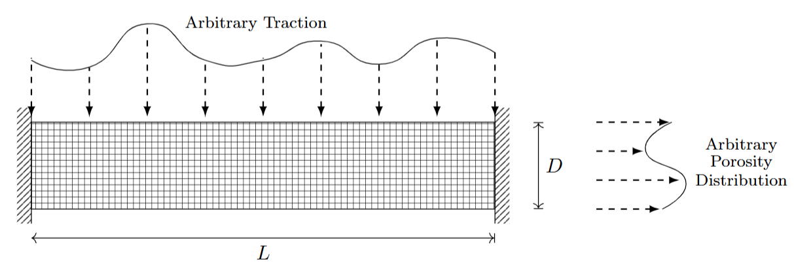
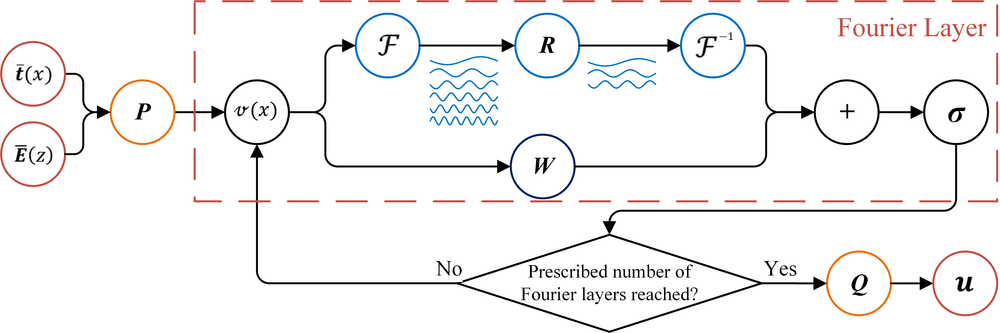
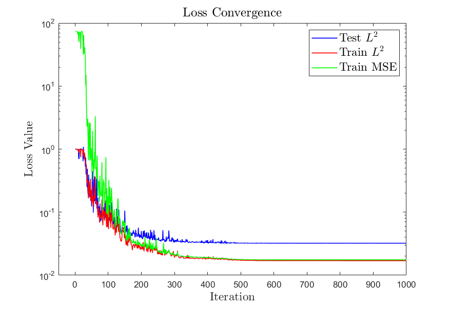

The code requires the following packages as imports:

-	numpy
-	torch
-	matplotlib
-	timeit
-	time
-	os
-	math
-	scipy
-	warnings
-	geomdl
-	pyevtk
- 
For creating database, run the following line:

•	python database/CreateData.py

After creating or downloading the database, for running the model, execute the following line:

•	python FNO-Beam.py

## FG Beams with Arbitrary Traction and Porosity Distribution

In this section, we illustrate the Neural Operator in the data-driven approach discussed in section [Neural Operators]. To exemplify this, the Fourier Neural Operator (FNO) has been trained to learn an operator that maps from arbitrary traction and porosity distribution functions into the displacement field of a beam with depth $D$ and length $L$. In other words, the networks are employed to solve a range of problems with different arbitrary traction functions and porosity distributions, as shown in the figure below. The beam is considered to be attached to supports at $x=0$ and $x=L$, and sustains a distributed load on the top edge of the beam.

The beam model follows the equation:

$$
X := \left\{ 
\begin{array}{ll} - \mathbf{\nabla} \cdot \left[ \mathbf{S} \cdot \left( \mathbf{I} + \mathbf{\nabla u} \right) \right] = 0  & \quad \text{for } x,\, z \in \Omega \\
\mathbf{u}(x,z) = 0 & \quad \text{ for } x=0, \, L \\
\sigma \cdot n = \hat{\mathbf{t}}\,(x) & \quad \text{for } z=D \\
\mathbf{S} = \mathbf{S}(\hat{\mathbf{E}}(z)) & \quad \text{for } x,\, z \in \Omega
\end{array} 
\right.
$$

The desired operator from this PDE is:

$$
\mathcal{G}^{\dagger} := L^{-1} \left\{\hat{\mathbf{t}}, \hat{\mathbf{E}}\right\} : \mathcal{U}^t \times \mathcal{U}^E \rightarrow \mathcal{U}
$$

which maps the traction and porosity distribution to the corresponding displacement:

$$
\left\{ \hat{\mathbf{t}}, \hat{\mathbf{E}} \right\} \mapsto \mathbf{u}
$$

Where:

- $\mathcal{U}^t$ is the space of continuous real-valued functions defined on the top boundary.
- $\mathcal{U}^E$ is the space of continuous real-valued functions defined on $[0,L]*[0,D]$.
- $\mathcal{U}$ is the space of continuous functions with values in $\mathbb{R}^2$, representing the $x$- and $z$-displacements.

### Data Generation and Validation

For data generation and validation, we use Isogeometric Analysis (IGA) and Gaussian Random Fields (GRF) for creating random smooth functions. The traction and porosity distribution are modeled using:

$$
\hat{\mathbf{t}}(x) \sim \sigma_{t} \times \mathcal{GP}(0, k_1(x_1, x_2)) + \mu_{t}
$$

$$
\hat{\mathbf{E}}(x) \sim \frac{E_{\text{max}}-E_{\text{min}}}{\mathcal{GP}_{\text{max}}-\mathcal{GP}_{\text{min}}} \times \left( \mathcal{GP}(0, k_1(x_1, x_2)) - \mathcal{GP}_{\text{min}} \right) + E_{\text{min}}
$$

where $\mathcal{GP}$ is a Gaussian process and $k_1(x_1,x_2)$ is an exponential quadratic covariance kernel. The data used for training consists of 4000 sets of GRF functions, and the validation is done using 400 additional sets.

### Fourier Neural Operator (FNO)

The FNO is structured as depicted below:

The FNO consists of multiple layers, with the inputs $\hat{\mathbf{t}}$ and $\hat{\mathbf{E}}$ undergoing a transformation to higher-dimensional representations through a fully connected neural network. Four Fourier layers then process these transformations, and the final output $u(x,z)$ is obtained through a projection layer. The Fourier layer is defined by:

$$
v_{t+1}(\chi) := \sigma \left( W\,v_t(\chi) + \left( \mathcal{K}(a;\phi)\,v_t \right) (\chi) \right)
$$

where $\mathcal{K}$ is a kernel integral operator defined by the Fourier transform.

### Results

The displacement field for different traction functions and material distributions is computed using the trained FNO model. The results show that the trained network can predict the displacement field for various traction functions and material distributions.

#### Displacement Field Distribution

The network's optimization used the Adam optimizer, and the model was trained with the GELU activation function. The training took approximately 337 seconds, and the trained model can solve the problem for any arbitrary function in approximately 3 milliseconds, significantly faster than traditional methods like IGA, which takes around 1.5 seconds.

### Loss Convergence

The convergence of the loss function during training is shown below:

### Conclusion

This approach demonstrates how the Fourier Neural Operator can efficiently map arbitrary traction and porosity distributions to the corresponding displacement fields, providing a powerful tool for solving complex beam deformation problems with varying material properties.

### References

1. C. Anitescu, M. N. Hossain, and T. Rabczuk. “Recovery-based error estimation and adaptivity using high-order splines over hierarchical T-meshes”. In: Computer Methods in Applied Mechanics and
Engineering 328 (2018), pp. 638–662. doi: https://doi.org/10.1016/j.cma.2017.08.032.
2. C. K. Williams and C. E. Rasmussen. Gaussian processes for machine learning. Vol. 2. 3. MIT press
Cambridge, MA, 2006. doi: https://doi.org/10.7551/mitpress/3206.001.0001.
3. D. Hendrycks and K. Gimpel. “Gaussian error linear units (GELUs)”. In: arXiv preprint arXiv:1606.08415
(2016). https://doi.org/doi:10.48550/arXiv.1606.08415.